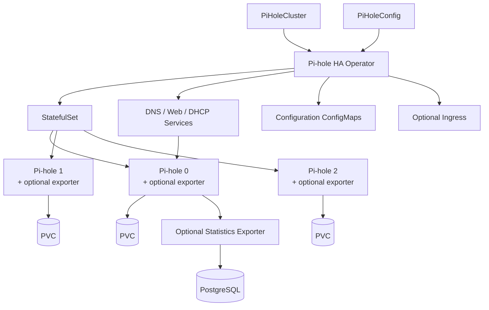

# Pi-hole HA Operator

A Kubernetes operator for running persistent, highly available Pi-hole clusters
with automatic primary/standby failover.

Pi-hole HA Operator manages the lifecycle of Pi-hole instances through the
`PiHoleCluster` custom resource. It creates and reconciles the required
StatefulSet, persistent storage, Services, configuration and optional Ingress
while maintaining a single active primary replica.

Configuration can be managed declaratively through `PiHoleConfig`, and optional
external statistics export can persist Pi-hole query history to PostgreSQL.

## Features

- Automatic primary/standby selection and failover
- Three-replica HA topology by default
- Persistent per-replica storage using StatefulSets and PVCs
- Declarative cluster management through `PiHoleCluster`
- Declarative Pi-hole configuration through `PiHoleConfig`
- Managed DNS, Web and optional DHCP Services
- Optional Kubernetes Ingress
- Configurable DNS upstreams, storage and Pod scheduling options
- Optional external query statistics export to PostgreSQL
- Kubernetes-native status and conditions
- Helm-based installation and upgrades
- Security-hardened controller and statistics exporter
- End-to-end tested failover and recovery behavior

## Motivation

A common weakness of self-hosted Pi-hole deployments is that the Pi-hole
instance can become a single point of failure for local DNS. If the host or
Kubernetes node running Pi-hole becomes unavailable, clients that depend on it
for DNS resolution may also lose name resolution.

Pi-hole HA Operator was built around that problem. Instead of relying on a
single Pi-hole instance, the operator maintains a primary with standby replicas
and can promote an eligible standby when the current primary becomes
unavailable.

## Why an Operator?
A `PiHoleCluster` describes the desired state of a Pi-hole deployment. The
operator continuously observes the cluster and reconciles Kubernetes resources
such as StatefulSets, Services, ConfigMaps and Ingresses to match that desired
state. It is declarative and reproducible giving pihole one source of truth.

Continuous reconciliation also allows the operator to manage behavior that
requires observing the cluster over time, such as detecting an unavailable
primary, selecting an eligible standby and moving traffic to the newly promoted
primary.

## Architecture



## Quick Start

### Install the operator

Add the Helm repository:

```bash
helm repo add paldab https://paldab.github.io/helm-charts
helm repo update
helm install pihole-ha-operator \
  paldab/pihole-ha-operator \
  --namespace pihole \
  --create-namespace
```

### Create your first cluster

Create the Pi-hole admin password Secret:
```bash
kubectl create secret generic pihole-admin \
  --namespace pihole \
  --from-literal=password='change-me'
```

Create the cluster manifest. You can find more examples under `config/samples/`.
```yaml
apiVersion: pihole.paldab.nl/v1alpha1
kind: PiHoleCluster
metadata:
  name: pihole
  namespace: pihole
spec:
  replicas: 3
  image: pihole/pihole:2026.05.0

  existingSecretRef:
    secretName: pihole-admin
```

Apply the resource and verify that the cluster becomes ready:
```bash
kubectl apply -f piholecluster.yaml

kubectl get piholeclusters -n pihole
kubectl get pods -n pihole
```

## High Availability and Failover
Pi-hole HA Operator uses a primary/standby model.

Exactly one eligible Pi-hole replica is selected as the primary. DNS and Web
Services route traffic to this replica.

If the primary becomes unavailable, the operator selects an eligible standby
and promotes it to primary. When the previous primary returns, it rejoins the
cluster as a standby instead of automatically reclaiming the primary role.

Failover behavior is covered by end-to-end tests including primary loss,
standby loss, repeated failovers and replica recovery.

| Replicas | Behavior |
|---:|---|
| `1` | Single Pi-hole instance with recovery, but no HA |
| `2` | One primary and one standby |
| `3` | One primary and two standbys; default and recommended topology |

Failover provides service availability, but Pi-hole runtime state is not replicated between replicas. See [Known Limitations](#known-limitations).

## PiHoleCluster
`PiHoleCluster` defines the desired state of a Pi-hole deployment.

The operator uses this resource to manage the Pi-hole StatefulSet, persistent
storage, Services, optional Ingress, primary/standby topology and optional
statistics exporters.

### Basic example

The following example shows the most commonly used `PiHoleCluster` options:

```yaml
apiVersion: pihole.paldab.nl/v1alpha1
kind: PiHoleCluster
metadata:
  name: home
spec:
  replicas: 3
  image: pihole/pihole:2026.05.0

  existingSecretRef:
    secretName: pihole-admin

  timezone: Europe/Amsterdam

  storage:
    size: 3Gi

  dnsUpstreams:
    - 1.1.1.1
    - 8.8.8.8

  services:
    web:
      enabled: true

    dns:
      enabled: true

    dhcp:
      enabled: false

  ingress:
    enabled: false
```

The operator provides defaults for several commonly used settings:

| Field | Default | Description |
| --- | ---: | --- |
| `spec.replicas` | `3` | Number of Pi-hole replicas |
| `spec.timezone` | `UTC` | Timezone passed to Pi-hole |
| `spec.storage.size` | `3Gi` | Persistent storage allocated per replica |
| `spec.services.web.enabled` | `true` | Creates the Pi-hole Web Service |
| `spec.services.dns.enabled` | `true` | Creates the Pi-hole DNS Service |
| `spec.services.dhcp.enabled` | `false` | Enables the optional DHCP Service |
| `spec.ingress.enabled` | `false` | Exposes the Pi-hole Web interface through an Ingress |

Each Pi-hole replica receives its own persistent volume.

### Advanced example

A more advanced configuration can customize networking, Pi-hole environment
variables, Ingress and external statistics.

The complete example is available at
`config/samples/advanced_cluster_example.yaml`.

```yaml
apiVersion: pihole.paldab.nl/v1alpha1
kind: PiHoleCluster
metadata:
  name: advanced-pihole
spec:
  replicas: 3
  image: pihole/pihole:2026.05.0

  existingSecretRef:
    secretName: advanced-pihole-admin-password
    passwordKey: password

  timezone: Europe/Amsterdam

  storage:
    size: 5Gi

  dnsUpstreams:
    - 8.8.8.8
    - 8.8.4.4

  config:
    env:
      - name: FTLCONF_misc_etc_dnsmasq_d
        value: "true"
      - name: FTLCONF_dns_listeningMode
        value: "all"

  statistics:
    mode: External
    external:
      database:
        # Example: PostgreSQL running in the "pihole" namespace
        host: postgres.pihole.svc.cluster.local
        dbName: pihole-statistics

        secretRef:
          # The Secret must exist before the PiHoleCluster is created.
          name: pihole-stats-db-secret
          usernameKey: username
          passwordKey: password

  services:
    dns:
      type: LoadBalancer
      loadBalancerIP: 192.168.1.10

  ingress:
    enabled: true
    host: pihole.example.com

    annotations:
      cert-manager.io/cluster-issuer: clusterissuer

    tls:
      secretName: pihole-tls
```
The `loadBalancerIP` property behavior depends on the LoadBalancer implementation used by the cluster.

## External statistics

When `statistics.mode` is set to `External`, the operator adds a statistics
exporter sidecar to **each Pi-hole replica**.

Each exporter reads the local replica's `pihole-FTL.db` and exports query data
to the configured PostgreSQL database.

```text
pihole-0 + exporter ─┐
pihole-1 + exporter ─┼──► PostgreSQL
pihole-2 + exporter ─┘
```

Statistics export is separate from the DNS serving path. Pi-hole does not
depend on PostgreSQL in order to answer DNS queries.

## Networking

### Service configuration

The DNS, Web and DHCP Services can be configured independently.

DNS and Web Services are enabled by default, while DHCP is disabled by default.

Services support the following Kubernetes Service types:

- `ClusterIP`
- `NodePort`
- `LoadBalancer`

DHCP support may require additional networking configuration depending on the
Kubernetes environment and CNI implementation.

### Ingress

Ingress is optional and disabled by default.

When enabled, a host must be provided. Annotations and an existing TLS Secret
can also be supplied, allowing the Ingress to integrate with controllers such
as Traefik and certificate management solutions such as cert-manager.

## PiHoleConfig
`PiHoleConfig` manages Pi-hole configuration separately from the lifecycle of
the Pi-hole cluster.

A configuration references a `PiHoleCluster` in the same namespace. Only one
`PiHoleConfig` may actively manage a cluster at a time.

The following example shows several configuration types supported by `PiHoleConfig`:
```yaml
apiVersion: pihole.paldab.nl/v1alpha1
kind: PiHoleConfig
metadata:
  name: pihole-config
  namespace: pihole
spec:
  clusterRef:
    name: pihole

  adlists:
    - https://example.com/blocklist.txt

  denylist:
    - ads.example.com

  allowlist:
    - allowed.example.com

  regexlist:
    - '(^|\.)tracking\.example$'

  hosts:
    router.home.local: 192.168.1.1
    nas.home.local: 192.168.1.20
    homeassistant.home.local: 192.168.1.40

  cnames:
    nas.home.local:
      - storage.home.local
      - files.home.local

    homeassistant.home.local:
      - ha.home.local
```

## Known Limitations

### Pi-hole runtime state is not replicated between replicas

The operator manages declarative configuration through `PiHoleConfig`, but
Pi-hole runtime state is not synchronized between replicas.

Changes made manually through the Pi-hole Web UI or directly inside one Pi-hole
instance apply only to that replica. If another replica is promoted to primary,
those manual changes may not be present.

For configuration that must remain consistent across replicas, use
`PiHoleConfig` rather than modifying individual Pi-hole instances manually.

### DHCP

DHCP support is available but is currently lightly tested. Kubernetes networking
behavior differs between environments, so additional network configuration may
be required depending on the cluster and CNI implementation.

## Tested Environments

The operator is currently tested with:

- Kind-based Kubernetes clusters in the end-to-end test suite
- k3s `v1.36.1+k3s1`
- Pi-hole `2026.05.0`

Other Kubernetes distributions may work, but are not currently part of the
project's regular test matrix.

## Testing

The project uses controller tests and Kind-based end-to-end tests.

The E2E suite covers reconciliation and HA behavior across one-, two- and
three-replica deployments, including primary loss, standby loss, repeated
failovers and recovery.

Helm installation and upgrade paths are also validated as part of the release
workflow. 

To run the test suites locally:
```bash
make test
make test-e2e
```

